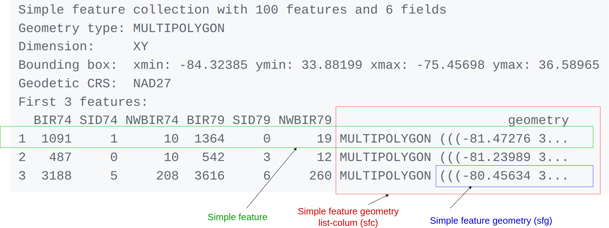

# 1. Simple Features for R

[Simple features](https://en.wikipedia.org/wiki/Simple_Features) or
[*simple feature access*](https://www.ogc.org/standards/sfa/) refers to
a formal standard (ISO 19125-1:2004) that describes how objects in the
real world can be represented in computers, with emphasis on the
*spatial* geometry of these objects. It also describes how such objects
can be stored in and retrieved from databases, and which geometrical
operations should be defined for them.

The standard is widely implemented in spatial databases (such as
[PostGIS](https://postgis.net/)), commercial GIS (e.g., [ESRI
ArcGIS](https://www.esri.com/en-us/home)) and forms the vector data
basis for libraries such as [GDAL](https://gdal.org/). A subset of
simple features forms the [GeoJSON](https://geojson.org/) standard.

This vignette:

- explains what is meant by features, and by `simple features`
- shows how they are implemented in R
- provides examples of how you can work with them
- shows how they can be read from and written to external files or
  resources (I/O)
- discusses how they can be converted to and from `sp` objects
- shows how they can be used for meaningful and applied spatial analysis

## What is a feature?

A `feature` is thought of as a thing, or an object in the real world,
such as a building or a tree. As is the case with objects, they often
consist of other objects. This is the case with features too: a set of
features can form a single feature. A forest stand can be a feature, a
forest can be a feature, a city can be a feature. A satellite image
pixel can be a feature, a complete image can be a feature too.

Features have a *geometry* describing *where* on Earth the feature is
located, and they have attributes, which describe other properties. The
geometry of a tree can be the delineation of its crown, of its stem, or
the point indicating its centre. Other properties may include its
height, color, diameter at breast height at a particular date, and so
on.

The standard says: “*A simple feature is defined by the OpenGIS Abstract
specification to have both spatial and non-spatial attributes. Spatial
attributes are geometry valued, and simple features are based on 2D
geometry with linear interpolation between vertices.*” We will see soon
that the same standard will extend its coverage beyond 2D and beyond
linear interpolation. Here, we take simple features as the data
structures and operations described in the
[standard](https://www.ogc.org/standards/sfa/).

### Dimensions

All geometries are composed of points. Points are coordinates in a 2-,
3- or 4-dimensional space. All points in a geometry have the same
dimensionality. In addition to X and Y coordinates, there are two
optional additional dimensions:

- a Z coordinate, denoting altitude
- an M coordinate (rarely used), denoting some *measure* that is
  associated with the point, rather than with the feature as a whole (in
  which case it would be a feature attribute); examples could be time of
  measurement, or measurement error of the coordinates

The four possible cases then are:

1.  two-dimensional points refer to x and y, easting and northing, or
    longitude and latitude, we refer to them as XY
2.  three-dimensional points as XYZ
3.  three-dimensional points as XYM
4.  four-dimensional points as XYZM (the third axis is Z, fourth M)

### Simple feature geometry types

The following seven simple feature types are the most common, and are
for instance the only ones used for
[GeoJSON](https://www.rfc-editor.org/rfc/rfc7946):

| type                 | description                                                                                                                                                                                                               |
|----------------------|---------------------------------------------------------------------------------------------------------------------------------------------------------------------------------------------------------------------------|
| `POINT`              | zero-dimensional geometry containing a single point                                                                                                                                                                       |
| `LINESTRING`         | sequence of points connected by straight, non-self intersecting line segments; one-dimensional geometry                                                                                                                   |
| `POLYGON`            | geometry with a positive area (two-dimensional); sequence of points form a closed, non-self intersecting ring; the first ring denotes the exterior ring, zero or more subsequent rings denote holes in this exterior ring |
| `MULTIPOINT`         | set of points; a MULTIPOINT is simple if no two Points in the MULTIPOINT are equal                                                                                                                                        |
| `MULTILINESTRING`    | set of linestrings                                                                                                                                                                                                        |
| `MULTIPOLYGON`       | set of polygons                                                                                                                                                                                                           |
| `GEOMETRYCOLLECTION` | set of geometries of any type except GEOMETRYCOLLECTION                                                                                                                                                                   |

Each of the geometry types can also be a (typed) empty set, containing
zero coordinates (for `POINT` the standard is not clear how to represent
the empty geometry). Empty geometries can be thought of being analogues
to missing (`NA`) attributes, NULL values or empty lists.

The remaining ten geometries are rare but are increasingly found:

| type                | description                                                                                                                                                                                                                                                                                                                                                                                                                                                                                                                                                                                                                       |
|---------------------|-----------------------------------------------------------------------------------------------------------------------------------------------------------------------------------------------------------------------------------------------------------------------------------------------------------------------------------------------------------------------------------------------------------------------------------------------------------------------------------------------------------------------------------------------------------------------------------------------------------------------------------|
| `CIRCULARSTRING`    | The CIRCULARSTRING is the basic curve type, similar to a LINESTRING in the linear world. A single segment requires three points, the start and end points (first and third) and any other point on the arc. The exception to this is for a closed circle, where the start and end points are the same. In this case the second point MUST be the center of the arc, i.e., the opposite side of the circle. To chain arcs together, the last point of the previous arc becomes the first point of the next arc, just like in LINESTRING. This means that a valid circular string must have an odd number of points greater than 1. |
| `COMPOUNDCURVE`     | A compound curve is a single, continuous curve that has both curved (circular) segments and linear segments. That means that in addition to having well-formed components, the end point of every component (except the last) must be coincident with the start point of the following component.                                                                                                                                                                                                                                                                                                                                 |
| `CURVEPOLYGON`      | Example compound curve in a curve polygon: CURVEPOLYGON(COMPOUNDCURVE(CIRCULARSTRING(0 0,2 0, 2 1, 2 3, 4 3),(4 3, 4 5, 1 4, 0 0)), CIRCULARSTRING(1.7 1, 1.4 0.4, 1.6 0.4, 1.6 0.5, 1.7 1) )                                                                                                                                                                                                                                                                                                                                                                                                                                     |
| `MULTICURVE`        | A MultiCurve is a 1-dimensional GeometryCollection whose elements are Curves, it can include linear strings, circular strings or compound strings.                                                                                                                                                                                                                                                                                                                                                                                                                                                                                |
| `MULTISURFACE`      | A MultiSurface is a 2-dimensional GeometryCollection whose elements are Surfaces, all using coordinates from the same coordinate reference system.                                                                                                                                                                                                                                                                                                                                                                                                                                                                                |
| `CURVE`             | A Curve is a 1-dimensional geometric object usually stored as a sequence of Points, with the subtype of Curve specifying the form of the interpolation between Points                                                                                                                                                                                                                                                                                                                                                                                                                                                             |
| `SURFACE`           | A Surface is a 2-dimensional geometric object                                                                                                                                                                                                                                                                                                                                                                                                                                                                                                                                                                                     |
| `POLYHEDRALSURFACE` | A PolyhedralSurface is a contiguous collection of polygons, which share common boundary segments                                                                                                                                                                                                                                                                                                                                                                                                                                                                                                                                  |
| `TIN`               | A TIN (triangulated irregular network) is a PolyhedralSurface consisting only of Triangle patches.                                                                                                                                                                                                                                                                                                                                                                                                                                                                                                                                |
| `TRIANGLE`          | A Triangle is a polygon with 3 distinct, non-collinear vertices and no interior boundary                                                                                                                                                                                                                                                                                                                                                                                                                                                                                                                                          |

Note that `CIRCULASTRING`, `COMPOUNDCURVE` and `CURVEPOLYGON` are not
described in the SFA standard, but in the [SQL-MM part 3
standard](https://www.iso.org/standard/38651.html). The descriptions
above were copied from the [PostGIS
manual](http://postgis.net/docs/using_postgis_dbmanagement.md).

### Coordinate reference system

Coordinates can only be placed on the Earth’s surface when their
coordinate reference system (CRS) is known; this may be a spheroid CRS
such as [WGS84](https://en.wikipedia.org/wiki/World_Geodetic_System), a
projected, two-dimensional (Cartesian) CRS such as a UTM zone or Web
Mercator, or a CRS in three-dimensions, or including time. Similarly,
M-coordinates need an attribute reference system, e.g. a [measurement
unit](https://CRAN.R-project.org/package=units).

## How simple features in R are organized

Package `sf` represents simple features as native R objects. Similar to
[PostGIS](http://postgis.net/), all functions and methods in `sf` that
operate on spatial data are prefixed by `st_`, which refers to *spatial
type*; this makes them easily findable by command-line completion.
Simple features are implemented as R native data, using simple data
structures (S3 classes, lists, matrix, vector). Typical use involves
reading, manipulating and writing of sets of features, with attributes
and geometries.

As attributes are typically stored in `data.frame` objects (or the very
similar `tbl_df`), we will also store feature geometries in a
`data.frame` column. Since geometries are not single-valued, they are
put in a list-column, a list of length equal to the number of records in
the `data.frame`, with each list element holding the simple feature
geometry of that feature. The three classes used to represent simple
features are:

- `sf`, the table (`data.frame`) with feature attributes and feature
  geometries, which contains
- `sfc`, the list-column with the geometries for each feature (record),
  which is composed of
- `sfg`, the feature geometry of an individual simple feature.

We will now discuss each of these three classes.

### sf: objects with simple features

As we usually do not work with geometries of single `simple features`,
but with datasets consisting of sets of features with attributes, the
two are put together in `sf` (simple feature) objects. The following
command reads the `nc` dataset from a file that is contained in the `sf`
package:

``` r
library(sf)
## Linking to GEOS 3.12.1, GDAL 3.8.4, PROJ 9.4.0; sf_use_s2() is TRUE
nc <- st_read(system.file("shape/nc.shp", package="sf"))
## Reading layer `nc' from data source 
##   `/home/runner/work/_temp/Library/sf/shape/nc.shp' using driver `ESRI Shapefile'
## Simple feature collection with 100 features and 14 fields
## Geometry type: MULTIPOLYGON
## Dimension:     XY
## Bounding box:  xmin: -84.32385 ymin: 33.88199 xmax: -75.45698 ymax: 36.58965
## Geodetic CRS:  NAD27
```

(Note that users will not use
[`system.file()`](https://rdrr.io/r/base/system.file.html) but give a
`filename` directly, and that shapefiles consist of more than one file,
all with identical basename, which reside in the same directory.) The
short report printed gives the file name, the driver (ESRI Shapefile),
mentions that there are 100 features (records, represented as rows) and
14 fields (attributes, represented as columns). This object is of class

``` r
class(nc)
## [1] "sf"         "data.frame"
```

meaning it extends (and “is” a) `data.frame`, but with a single
list-column with geometries, which is held in the column with name

``` r
attr(nc, "sf_column")
## [1] "geometry"
```

If we print the first three features, we see their attribute values and
an abridged version of the geometry

``` r
print(nc[9:15], n = 3)
```

which would give the following output:



In the output we see:

- in green a simple feature: a single record, or `data.frame` row,
  consisting of attributes and geometry
- in blue a single simple feature geometry (an object of class `sfg`)
- in red a simple feature list-column (an object of class `sfc`, which
  is a column in the `data.frame`)
- that although geometries are native R objects, they are printed as
  [well-known text](#wkb)

Methods for `sf` objects are:

``` r
methods(class = "sf")
##  [1] [                            [[<-                        
##  [3] [<-                          $<-                         
##  [5] aggregate                    as.data.frame               
##  [7] cbind                        coerce                      
##  [9] dbDataType                   dbWriteTable                
## [11] duplicated                   identify                    
## [13] initialize                   merge                       
## [15] plot                         points                      
## [17] print                        rbind                       
## [19] show                         slotsFromS3                 
## [21] st_agr                       st_agr<-                    
## [23] st_area                      st_as_s2                    
## [25] st_as_sf                     st_as_sfc                   
## [27] st_bbox                      st_boundary                 
## [29] st_break_antimeridian        st_buffer                   
## [31] st_cast                      st_centroid                 
## [33] st_collection_extract        st_concave_hull             
## [35] st_convex_hull               st_coordinates              
## [37] st_crop                      st_crs                      
## [39] st_crs<-                     st_difference               
## [41] st_drop_geometry             st_exterior_ring            
## [43] st_filter                    st_geometry                 
## [45] st_geometry<-                st_inscribed_circle         
## [47] st_interpolate_aw            st_intersection             
## [49] st_intersects                st_is_full                  
## [51] st_is_valid                  st_is                       
## [53] st_join                      st_line_merge               
## [55] st_m_range                   st_make_valid               
## [57] st_minimum_bounding_circle   st_minimum_rotated_rectangle
## [59] st_nearest_points            st_node                     
## [61] st_normalize                 st_point_on_surface         
## [63] st_polygonize                st_precision                
## [65] st_reverse                   st_sample                   
## [67] st_segmentize                st_set_precision            
## [69] st_shift_longitude           st_simplify                 
## [71] st_snap                      st_sym_difference           
## [73] st_transform                 st_triangulate_constrained  
## [75] st_triangulate               st_union                    
## [77] st_voronoi                   st_wrap_dateline            
## [79] st_write                     st_z_range                  
## [81] st_zm                        text                        
## [83] transform                   
## see '?methods' for accessing help and source code
```

It is also possible to create `data.frame` objects with geometry
list-columns that are not of class `sf`, e.g. by:

``` r
nc.no_sf <- as.data.frame(nc)
class(nc.no_sf)
## [1] "data.frame"
```

However, such objects:

- no longer register which column is the geometry list-column
- no longer have a plot method, and
- lack all of the other dedicated methods listed above for class `sf`

### sfc: simple feature geometry list-column

The column in the `sf` data.frame that contains the geometries is a
list, of class `sfc`. We can retrieve the geometry list-column in this
case by `nc$geom` or `nc[[15]]`, but the more general way uses
[`st_geometry()`](https://r-spatial.github.io/sf/reference/st_geometry.md):

``` r
(nc_geom <- st_geometry(nc))
## Geometry set for 100 features 
## Geometry type: MULTIPOLYGON
## Dimension:     XY
## Bounding box:  xmin: -84.32385 ymin: 33.88199 xmax: -75.45698 ymax: 36.58965
## Geodetic CRS:  NAD27
## First 5 geometries:
## MULTIPOLYGON (((-81.47276 36.23436, -81.54084 3...
## MULTIPOLYGON (((-81.23989 36.36536, -81.24069 3...
## MULTIPOLYGON (((-80.45634 36.24256, -80.47639 3...
## MULTIPOLYGON (((-76.00897 36.3196, -76.01735 36...
## MULTIPOLYGON (((-77.21767 36.24098, -77.23461 3...
```

Geometries are printed in abbreviated form, but we can view a complete
geometry by selecting it, e.g. the first one by:

``` r
nc_geom[[1]]
## MULTIPOLYGON (((-81.47276 36.23436, -81.54084 36.27251, -81.56198 36.27359, -81.63306 36.34069, -81.74107 36.39178, -81.69828 36.47178, -81.7028 36.51934, -81.67 36.58965, -81.3453 36.57286, -81.34754 36.53791, -81.32478 36.51368, -81.31332 36.4807, -81.26624 36.43721, -81.26284 36.40504, -81.24069 36.37942, -81.23989 36.36536, -81.26424 36.35241, -81.32899 36.3635, -81.36137 36.35316, -81.36569 36.33905, -81.35413 36.29972, -81.36745 36.2787, -81.40639 36.28505, -81.41233 36.26729, -81.43104 36.26072, -81.45289 36.23959, -81.47276 36.23436)))
```

The way this is printed is called *well-known text*, and is part of the
standards. The word `MULTIPOLYGON` is followed by three parentheses,
because it can consist of multiple polygons, in the form of
`MULTIPOLYGON(POL1,POL2)`, where `POL1` might consist of an exterior
ring and zero or more interior rings, as of `(EXT1,HOLE1,HOLE2)`. Sets
of coordinates belonging to a single polygon are held together with
parentheses, so we get `((crds_ext)(crds_hole1)(crds_hole2))` where
`crds_` is a comma-separated set of coordinates of a ring. This leads to
the case above, where `MULTIPOLYGON(((crds_ext)))` refers to the
exterior ring (1), without holes (2), of the first polygon (3) - hence
three parentheses.

We can see there is a single polygon with no rings:

``` r
par(mar = c(0,0,1,0))
plot(nc[1], reset = FALSE) # reset = FALSE: we want to add to a plot with a legend
plot(nc[1,1], col = 'grey', add = TRUE)
```


but some of the polygons in this dataset have multiple exterior rings;
they can be identified by:

``` r
par(mar = c(0,0,1,0))
(w <- which(sapply(nc_geom, length) > 1))
## [1]  4 56 57 87 91 95
plot(nc[w,1], col = 2:7)
```


Following the `MULTIPOLYGON` datastructure, in R we have a list of lists
of lists of matrices. For instance, we get the first 3 coordinate pairs
of the second exterior ring (first ring is always exterior) for the
geometry of feature 4 by:

``` r
nc_geom[[4]][[2]][[1]][1:3,]
##           [,1]     [,2]
## [1,] -76.02717 36.55672
## [2,] -75.99866 36.55665
## [3,] -75.91192 36.54253
```

Geometry columns have their own class,

``` r
class(nc_geom)
## [1] "sfc_MULTIPOLYGON" "sfc"
```

Methods for geometry list-columns include:

``` r
methods(class = 'sfc')
##  [1] [                            [<-                         
##  [3] as.data.frame                c                           
##  [5] coerce                       format                      
##  [7] identify                     initialize                  
##  [9] Ops                          points                      
## [11] print                        rep                         
## [13] show                         slotsFromS3                 
## [15] st_area                      st_as_binary                
## [17] st_as_grob                   st_as_s2                    
## [19] st_as_sf                     st_as_text                  
## [21] st_bbox                      st_boundary                 
## [23] st_break_antimeridian        st_buffer                   
## [25] st_cast                      st_centroid                 
## [27] st_collection_extract        st_concave_hull             
## [29] st_convex_hull               st_coordinates              
## [31] st_crop                      st_crs                      
## [33] st_crs<-                     st_difference               
## [35] st_exterior_ring             st_geometry                 
## [37] st_inscribed_circle          st_intersection             
## [39] st_intersects                st_is_full                  
## [41] st_is_valid                  st_is                       
## [43] st_line_merge                st_m_range                  
## [45] st_make_valid                st_minimum_bounding_circle  
## [47] st_minimum_rotated_rectangle st_nearest_points           
## [49] st_node                      st_normalize                
## [51] st_point_on_surface          st_polygonize               
## [53] st_precision                 st_reverse                  
## [55] st_sample                    st_segmentize               
## [57] st_set_precision             st_shift_longitude          
## [59] st_simplify                  st_snap                     
## [61] st_sym_difference            st_transform                
## [63] st_triangulate_constrained   st_triangulate              
## [65] st_union                     st_voronoi                  
## [67] st_wrap_dateline             st_write                    
## [69] st_z_range                   st_zm                       
## [71] str                          summary                     
## [73] text                         unique                      
## [75] xtfrm                       
## see '?methods' for accessing help and source code
```

Coordinate reference systems
([`st_crs()`](https://r-spatial.github.io/sf/reference/st_crs.md) and
[`st_transform()`](https://r-spatial.github.io/sf/reference/st_transform.md))
are discussed in the section on [coordinate reference systems](#crs).
`st_as_wkb()` and
[`st_as_text()`](https://r-spatial.github.io/sf/reference/st_as_text.md)
convert geometry list-columns into well-known-binary or well-known-text,
explained [below](#wkb).
[`st_bbox()`](https://r-spatial.github.io/sf/reference/st_bbox.md)
retrieves the coordinate bounding box.

Attributes include:

``` r
attributes(nc_geom)
## $n_empty
## [1] 0
## 
## $crs
## Coordinate Reference System:
##   User input: NAD27 
##   wkt:
## GEOGCRS["NAD27",
##     DATUM["North American Datum 1927",
##         ELLIPSOID["Clarke 1866",6378206.4,294.978698213898,
##             LENGTHUNIT["metre",1]]],
##     PRIMEM["Greenwich",0,
##         ANGLEUNIT["degree",0.0174532925199433]],
##     CS[ellipsoidal,2],
##         AXIS["latitude",north,
##             ORDER[1],
##             ANGLEUNIT["degree",0.0174532925199433]],
##         AXIS["longitude",east,
##             ORDER[2],
##             ANGLEUNIT["degree",0.0174532925199433]],
##     ID["EPSG",4267]]
## 
## $class
## [1] "sfc_MULTIPOLYGON" "sfc"             
## 
## $precision
## [1] 0
## 
## $bbox
##      xmin      ymin      xmax      ymax 
## -84.32385  33.88199 -75.45698  36.58965
```

### Mixed geometry types

The class of `nc_geom` is `c("sfc_MULTIPOLYGON", "sfc")`: `sfc` is
shared with all geometry types, and `sfc_TYPE` with `TYPE` indicating
the type of the particular geometry at hand.

There are two “special” types: `GEOMETRYCOLLECTION`, and `GEOMETRY`.
`GEOMETRYCOLLECTION` indicates that each of the geometries may contain a
mix of geometry types, as in

``` r
(mix <- st_sfc(st_geometrycollection(list(st_point(1:2))),
    st_geometrycollection(list(st_linestring(matrix(1:4,2))))))
## Geometry set for 2 features 
## Geometry type: GEOMETRYCOLLECTION
## Dimension:     XY
## Bounding box:  xmin: 1 ymin: 2 xmax: 2 ymax: 4
## CRS:           NA
## GEOMETRYCOLLECTION (POINT (1 2))
## GEOMETRYCOLLECTION (LINESTRING (1 3, 2 4))
class(mix)
## [1] "sfc_GEOMETRYCOLLECTION" "sfc"
```

Still, the geometries are here of a single type.

The second `GEOMETRY`, indicates that the geometries in the geometry
list-column are of varying type:

``` r
(mix <- st_sfc(st_point(1:2), st_linestring(matrix(1:4,2))))
## Geometry set for 2 features 
## Geometry type: GEOMETRY
## Dimension:     XY
## Bounding box:  xmin: 1 ymin: 2 xmax: 2 ymax: 4
## CRS:           NA
## POINT (1 2)
## LINESTRING (1 3, 2 4)
class(mix)
## [1] "sfc_GEOMETRY" "sfc"
```

These two are fundamentally different: `GEOMETRY` is a superclass
without instances, `GEOMETRYCOLLECTION` is a geometry instance.
`GEOMETRY` list-columns occur when we read in a data source with a mix
of geometry types. `GEOMETRYCOLLECTION` *is* a single feature’s
geometry: the intersection of two feature polygons may consist of
points, lines and polygons, see the example
[below](#geometrycollection).

### sfg: simple feature geometry

Simple feature geometry (`sfg`) objects carry the geometry for a single
feature, e.g. a point, linestring or polygon.

Simple feature geometries are implemented as R native data, using the
following rules

1.  a single POINT is a numeric vector
2.  a set of points, e.g. in a LINESTRING or ring of a POLYGON is a
    `matrix`, each row containing a point
3.  any other set is a `list`

Creator functions are rarely used in practice, since we typically bulk
read and write spatial data. They are useful for illustration:

``` r
(x <- st_point(c(1,2)))
## POINT (1 2)
str(x)
##  'XY' num [1:2] 1 2
(x <- st_point(c(1,2,3)))
## POINT Z (1 2 3)
str(x)
##  'XYZ' num [1:3] 1 2 3
(x <- st_point(c(1,2,3), "XYM"))
## POINT M (1 2 3)
str(x)
##  'XYM' num [1:3] 1 2 3
(x <- st_point(c(1,2,3,4)))
## POINT ZM (1 2 3 4)
str(x)
##  'XYZM' num [1:4] 1 2 3 4
st_zm(x, drop = TRUE, what = "ZM")
## POINT (1 2)
```

This means that we can represent 2-, 3- or 4-dimensional coordinates.
All geometry objects inherit from `sfg` (simple feature geometry), but
also have a type (e.g. `POINT`), and a dimension (e.g. `XYM`) class
name. A figure illustrates six of the seven most common types.

With the exception of the `POINT` which has a single point as geometry,
the remaining six common single simple feature geometry types that
correspond to single features (single records, or rows in a
`data.frame`) are created like this

``` r
p <- rbind(c(3.2,4), c(3,4.6), c(3.8,4.4), c(3.5,3.8), c(3.4,3.6), c(3.9,4.5))
(mp <- st_multipoint(p))
## MULTIPOINT ((3.2 4), (3 4.6), (3.8 4.4), (3.5 3.8), (3.4 3.6), (3.9 4.5))
s1 <- rbind(c(0,3),c(0,4),c(1,5),c(2,5))
(ls <- st_linestring(s1))
## LINESTRING (0 3, 0 4, 1 5, 2 5)
s2 <- rbind(c(0.2,3), c(0.2,4), c(1,4.8), c(2,4.8))
s3 <- rbind(c(0,4.4), c(0.6,5))
(mls <- st_multilinestring(list(s1,s2,s3)))
## MULTILINESTRING ((0 3, 0 4, 1 5, 2 5), (0.2 3, 0.2 4, 1 4.8, 2 4.8), (0 4.4, 0.6 5))
p1 <- rbind(c(0,0), c(1,0), c(3,2), c(2,4), c(1,4), c(0,0))
p2 <- rbind(c(1,1), c(1,2), c(2,2), c(1,1))
pol <-st_polygon(list(p1,p2))
p3 <- rbind(c(3,0), c(4,0), c(4,1), c(3,1), c(3,0))
p4 <- rbind(c(3.3,0.3), c(3.8,0.3), c(3.8,0.8), c(3.3,0.8), c(3.3,0.3))[5:1,]
p5 <- rbind(c(3,3), c(4,2), c(4,3), c(3,3))
(mpol <- st_multipolygon(list(list(p1,p2), list(p3,p4), list(p5))))
## MULTIPOLYGON (((0 0, 1 0, 3 2, 2 4, 1 4, 0 0), (1 1, 1 2, 2 2, 1 1)), ((3 0, 4 0, 4 1, 3 1, 3 0), (3.3 0.3, 3.3 0.8, 3.8 0.8, 3.8 0.3, 3.3 0.3)), ((3 3, 4 2, 4 3, 3 3)))
(gc <- st_geometrycollection(list(mp, mpol, ls)))
## GEOMETRYCOLLECTION (MULTIPOINT ((3.2 4), (3 4.6), (3.8 4.4), (3.5 3.8), (3.4 3.6), (3.9 4.5)), MULTIPOLYGON (((0 0, 1 0, 3 2, 2 4, 1 4, 0 0), (1 1, 1 2, 2 2, 1 1)), ((3 0, 4 0, 4 1, 3 1, 3 0), (3.3 0.3, 3.3 0.8, 3.8 0.8, 3.8 0.3, 3.3 0.3)), ((3 3, 4 2, 4 3, 3 3))), LINESTRING (0 3, 0 4, 1 5, 2 5))
```

The objects created are shown here:


Geometries can also be empty, as in

``` r
(x <- st_geometrycollection())
## GEOMETRYCOLLECTION EMPTY
length(x)
## [1] 0
```

### Well-known text, well-known binary, precision

#### WKT and WKB

Well-known text (WKT) and well-known binary (WKB) are two encodings for
simple feature geometries. Well-known text, e.g. seen in

``` r
x <- st_linestring(matrix(10:1,5))
st_as_text(x)
## [1] "LINESTRING (10 5, 9 4, 8 3, 7 2, 6 1)"
```

(but without the leading `## [1]` and quotes), is human-readable.
Coordinates are usually floating point numbers, and moving large amounts
of information as text is slow and imprecise. For that reason, we use
well-known binary (WKB) encoding

``` r
st_as_binary(x)
##  [1] 01 02 00 00 00 05 00 00 00 00 00 00 00 00 00 24 40 00 00 00 00 00 00 14 40
## [26] 00 00 00 00 00 00 22 40 00 00 00 00 00 00 10 40 00 00 00 00 00 00 20 40 00
## [51] 00 00 00 00 00 08 40 00 00 00 00 00 00 1c 40 00 00 00 00 00 00 00 40 00 00
## [76] 00 00 00 00 18 40 00 00 00 00 00 00 f0 3f
```

WKT and WKB can both be transformed back into R native objects by

``` r
st_as_sfc("LINESTRING(10 5, 9 4, 8 3, 7 2, 6 1)")[[1]]
## LINESTRING (10 5, 9 4, 8 3, 7 2, 6 1)
st_as_sfc(structure(list(st_as_binary(x)), class = "WKB"))[[1]]
## LINESTRING (10 5, 9 4, 8 3, 7 2, 6 1)
```

GDAL, GEOS, spatial databases and GIS read and write WKB which is fast
and precise. Conversion between R native objects and WKB is done by
package `sf` in compiled (C++/Rcpp) code, making this a reusable and
fast route for I/O of simple feature geometries in R.

#### Precision

One of the attributes of a geometry list-column (`sfc`) is the
`precision`: a double number that, when non-zero, causes some rounding
during conversion to WKB, which might help certain geometrical
operations succeed that would otherwise fail due to floating point
representation. The model is that of GEOS, which copies from the Java
Topology Suite ([JTS](https://locationtech.github.io/jts/)), and works
like this:

- if precision is zero (default, unspecified), nothing is modified
- negative values convert to float (4-byte real) precision
- positive values convert to `round(x*precision)/precision`.

For the precision model, see also
[here](https://locationtech.github.io/jts/javadoc/org/locationtech/jts/geom/PrecisionModel.html),
where it is written that: “… to specify 3 decimal places of precision,
use a scale factor of 1000. To specify -3 decimal places of precision
(i.e. rounding to the nearest 1000), use a scale factor of 0.001.” Note
that all coordinates, so also `Z` or `M` values (if present) are
affected. Choosing values for `precision` may require some
experimenting.

### Reading and writing

As we’ve seen above, reading spatial data from an external file can be
done by:

``` r
filename <- system.file("shape/nc.shp", package="sf")
nc <- st_read(filename)
## Reading layer `nc' from data source 
##   `/home/runner/work/_temp/Library/sf/shape/nc.shp' using driver `ESRI Shapefile'
## Simple feature collection with 100 features and 14 fields
## Geometry type: MULTIPOLYGON
## Dimension:     XY
## Bounding box:  xmin: -84.32385 ymin: 33.88199 xmax: -75.45698 ymax: 36.58965
## Geodetic CRS:  NAD27
```

we can suppress the output by adding argument `quiet=TRUE` or by using
the otherwise nearly identical but more quiet

``` r
nc <- read_sf(filename)
```

Writing takes place in the same fashion, using
[`st_write()`](https://r-spatial.github.io/sf/reference/st_write.md):

``` r
st_write(nc, "nc.shp")
## Writing layer `nc' to data source `nc.shp' using driver `ESRI Shapefile'
## Writing 100 features with 14 fields and geometry type Multi Polygon.
```

If we repeat this, we get an error message that the file already exists,
and we can overwrite by:

``` r
st_write(nc, "nc.shp", delete_layer = TRUE)
## Deleting layer `nc' using driver `ESRI Shapefile'
## Writing layer `nc' to data source `nc.shp' using driver `ESRI Shapefile'
## Writing 100 features with 14 fields and geometry type Multi Polygon.
```

or its quiet alternative that does this by default,

``` r
write_sf(nc, "nc.shp") # silently overwrites
```

#### Driver-specific options

The `dsn` and `layer` arguments to
[`st_read()`](https://r-spatial.github.io/sf/reference/st_read.md) and
[`st_write()`](https://r-spatial.github.io/sf/reference/st_write.md)
denote a data source name and optionally a layer name. Their exact
interpretation as well as the options they support vary per driver, the
[GDAL driver
documentation](https://gdal.org/en/latest/drivers/vector/index.html) is
best consulted for this. For instance, a PostGIS table in database
`postgis` might be read by:

``` r
meuse <- st_read("PG:dbname=postgis", "meuse")
```

where the `PG:` string indicates this concerns the PostGIS driver,
followed by database name, and possibly port and user credentials. When
the `layer` and `driver` arguments are not specified,
[`st_read()`](https://r-spatial.github.io/sf/reference/st_read.md) tries
to guess them from the datasource, or else simply reads the first layer,
giving a warning in case there are more.

[`st_read()`](https://r-spatial.github.io/sf/reference/st_read.md)
typically reads the coordinate reference system as `proj4string`, but
not the EPSG (SRID). GDAL cannot retrieve SRID (EPSG code) from
`proj4string` strings, and, when needed, it has to be set by the user.
See also the section on [coordinate reference systems](#crs).

[`st_drivers()`](https://r-spatial.github.io/sf/reference/st_drivers.md)
returns a `data.frame` listing available drivers, and their metadata:
names, whether a driver can write, and whether it is a raster and/or
vector driver. All drivers can read. Reading of some common data formats
is illustrated below:

`st_layers(dsn)` lists the layers present in data source `dsn`, and
gives the number of fields, features and geometry type for each layer:

``` r
st_layers(system.file("osm/overpass.osm", package="sf"))
```

we see that in this case, the number of features is `NA` because for
this xml file the whole file needs to be read, which may be costly for
large files. We can force counting by:

``` r
Sys.setenv(OSM_USE_CUSTOM_INDEXING="NO")
st_layers(system.file("osm/overpass.osm", package="sf"), do_count = TRUE)
```

Another example of reading kml and kmz files is:

``` r
# Download .shp data
u_shp <- "http://coagisweb.cabq.gov/datadownload/biketrails.zip"
download.file(u_shp, "biketrails.zip")
unzip("biketrails.zip")
u_kmz <- "http://coagisweb.cabq.gov/datadownload/BikePaths.kmz"
download.file(u_kmz, "BikePaths.kmz")

# Read file formats
biketrails_shp <- st_read("biketrails.shp")
if(Sys.info()[1] == "Linux") # may not work if not Linux
  biketrails_kmz <- st_read("BikePaths.kmz")
u_kml = "http://www.northeastraces.com/oxonraces.com/nearme/safe/6.kml"
download.file(u_kml, "bikeraces.kml")
bikraces <- st_read("bikeraces.kml")
```

#### Create, read, update and delete

GDAL provides the
[crud](https://en.wikipedia.org/wiki/Create,_read,_update_and_delete)
(create, read, update, delete) functions to persistent storage.
[`st_read()`](https://r-spatial.github.io/sf/reference/st_read.md) (or
[`read_sf()`](https://r-spatial.github.io/sf/reference/st_read.md)) are
used for reading.
[`st_write()`](https://r-spatial.github.io/sf/reference/st_write.md) (or
[`write_sf()`](https://r-spatial.github.io/sf/reference/st_write.md))
creates, and has the following arguments to control update and delete:

- `update=TRUE` causes an existing data source to be updated, if it
  exists; this option is by default `TRUE` for all database drivers,
  where the database is updated by adding a table.
- `delete_layer=TRUE` causes `st_write` try to open the data source and
  delete the layer; no errors are given if the data source is not
  present, or the layer does not exist in the data source.
- `delete_dsn=TRUE` causes `st_write` to delete the data source when
  present, before writing the layer in a newly created data source. No
  error is given when the data source does not exist. This option should
  be handled with care, as it may wipe complete directories or
  databases.

#### Connection to spatial databases

Read and write functions,
[`st_read()`](https://r-spatial.github.io/sf/reference/st_read.md) and
[`st_write()`](https://r-spatial.github.io/sf/reference/st_write.md),
can handle connections to spatial databases to read WKB or WKT directly
without using GDAL. Although intended to use the DBI interface, current
use and testing of these functions are limited to PostGIS.

### Coordinate reference systems and transformations

Coordinate reference systems (CRS) are like measurement units for
coordinates: they specify which location on Earth a particular
coordinate pair refers to. We saw above that `sfc` objects (geometry
list-columns) have an attribute of class `crs` that stores the CRS. This
implies that all geometries in a geometry list-column have the same CRS.
It may be `NA` in case the CRS is unknown, or when we work with local
coordinate systems (e.g. inside a building, a body, or an abstract
space); in that case coordinates are assumed to be Cartesian (in case of
2D: defining positions on in a flat plane).

A `crs` object contains two character fields: `input` for the name (if
existing) or the user-definition of the CRS, and `wkt` for the WKT-2
specification; WKT-2 is a standard encoding for describing CRS that is
used throughout the spatial data science industry. When defining a CRS,
a PROJ string may be used that is understood by the
[PROJ](https://proj.org/) library. It defines projection types and
(often) defines parameter values for particular projections, and hence
can cover an infinite amount of different projections. Alternatively,
codes like `EPSG:3035` or `OGC:CRS84` may be used; these are well-known
identifiers of CRS defined in the PROJ database.

Coordinate reference system transformations are carried out using
[`st_transform()`](https://r-spatial.github.io/sf/reference/st_transform.md),
e.g. converting longitudes/latitudes in NAD27 to Web Mercator
(EPSG:3857) can be done by:

``` r
nc.web_mercator <- st_transform(nc, "EPSG:3857")
st_geometry(nc.web_mercator)[[4]][[2]][[1]][1:3,]
##          [,1]    [,2]
## [1,] -8463267 4377507
## [2,] -8460094 4377498
## [3,] -8450437 4375541
```

### Conversion, including to and from sp

`sf` objects and objects deriving from `Spatial` (package `sp`) can be
coerced both ways:

``` r
showMethods("coerce", classes = "sf")
## Function: coerce (package methods)
## from="sf", to="Spatial"
## from="Spatial", to="sf"
methods(st_as_sf)
##  [1] st_as_sf.data.frame*   st_as_sf.lpp*          st_as_sf.map*         
##  [4] st_as_sf.owin*         st_as_sf.ppp*          st_as_sf.ppplist*     
##  [7] st_as_sf.psp*          st_as_sf.s2_geography* st_as_sf.sf*          
## [10] st_as_sf.sfc*          st_as_sf.Spatial*      st_as_sf.SpatVector*  
## see '?methods' for accessing help and source code
methods(st_as_sfc)
##  [1] st_as_sfc.bbox*               st_as_sfc.blob*              
##  [3] st_as_sfc.character*          st_as_sfc.dimensions*        
##  [5] st_as_sfc.factor*             st_as_sfc.list*              
##  [7] st_as_sfc.map*                st_as_sfc.owin*              
##  [9] st_as_sfc.pq_geometry*        st_as_sfc.psp*               
## [11] st_as_sfc.raw*                st_as_sfc.s2_geography*      
## [13] st_as_sfc.sf*                 st_as_sfc.SpatialLines*      
## [15] st_as_sfc.SpatialMultiPoints* st_as_sfc.SpatialPixels*     
## [17] st_as_sfc.SpatialPoints*      st_as_sfc.SpatialPolygons*   
## [19] st_as_sfc.tess*               st_as_sfc.WKB*               
## see '?methods' for accessing help and source code

# anticipate that sp::CRS will expand proj4strings:
p4s <- "+proj=longlat +datum=NAD27 +no_defs +ellps=clrk66 +nadgrids=@conus,@alaska,@ntv2_0.gsb,@ntv1_can.dat"
st_crs(nc) <- p4s

# anticipate geometry column name changes:
names(nc)[15] = "geometry"
attr(nc, "sf_column") = "geometry"
nc.sp <- as(nc, "Spatial")
class(nc.sp)
## [1] "SpatialPolygonsDataFrame"
## attr(,"package")
## [1] "sp"
nc2 <- st_as_sf(nc.sp)
all.equal(nc, nc2)
## [1] "Attributes: < Component \"class\": Lengths (4, 2) differ (string compare on first 2) >"           
## [2] "Attributes: < Component \"class\": 1 string mismatch >"                                           
## [3] "Component \"geometry\": Attributes: < Component \"crs\": Component \"input\": 1 string mismatch >"
## [4] "Component \"geometry\": Attributes: < Component \"crs\": Component \"wkt\": 1 string mismatch >"
```

As the `Spatial*` objects only support `MULTILINESTRING` and
`MULTIPOLYGON`, `LINESTRING` and `POLYGON` geometries are automatically
coerced into their `MULTI` form. When converting `Spatial*` into `sf`,
if all geometries consist of a single `POLYGON` (possibly with holes), a
`POLYGON` and otherwise all geometries are returned as `MULTIPOLYGON`: a
mix of `POLYGON` and `MULTIPOLYGON` (such as common in shapefiles) is
not created. Argument `forceMulti=TRUE` will override this, and create
`MULTIPOLYGON`s in all cases. For `LINES` the situation is identical.

### Geometrical operations

The standard for simple feature access defines a number of geometrical
operations.

[`st_is_valid()`](https://r-spatial.github.io/sf/reference/valid.md) and
[`st_is_simple()`](https://r-spatial.github.io/sf/reference/geos_query.md)
return a Boolean indicating whether a geometry is valid or simple.

``` r
st_is_valid(nc[1:2,])
## [1] TRUE TRUE
```

[`st_distance()`](https://r-spatial.github.io/sf/reference/geos_measures.md)
returns a dense numeric matrix with distances between geometries.
[`st_relate()`](https://r-spatial.github.io/sf/reference/st_relate.md)
returns a character matrix with the
[DE9-IM](https://en.wikipedia.org/wiki/DE-9IM#Illustration) values for
each pair of geometries:

``` r
x = st_transform(nc, 32119)
st_distance(x[c(1,4,22),], x[c(1, 33,55,56),])
## Units: [m]
##           [,1]     [,2]      [,3]     [,4]
## [1,]      0.00 312176.2 128338.51 475608.8
## [2,] 440548.35 114938.1 590417.79      0.0
## [3,]  18943.74 352708.6  78754.75 517511.6
st_relate(nc[1:5,], nc[1:4,])
## although coordinates are longitude/latitude, st_relate assumes that they are
## planar
##      [,1]        [,2]        [,3]        [,4]       
## [1,] "2FFF1FFF2" "FF2F11212" "FF2FF1212" "FF2FF1212"
## [2,] "FF2F11212" "2FFF1FFF2" "FF2F11212" "FF2FF1212"
## [3,] "FF2FF1212" "FF2F11212" "2FFF1FFF2" "FF2FF1212"
## [4,] "FF2FF1212" "FF2FF1212" "FF2FF1212" "2FFF1FFF2"
## [5,] "FF2FF1212" "FF2FF1212" "FF2FF1212" "FF2FF1212"
```

[`st_intersects()`](https://r-spatial.github.io/sf/reference/geos_binary_pred.md),
[`st_disjoint()`](https://r-spatial.github.io/sf/reference/geos_binary_pred.md),
[`st_touches()`](https://r-spatial.github.io/sf/reference/geos_binary_pred.md),
[`st_crosses()`](https://r-spatial.github.io/sf/reference/geos_binary_pred.md),
[`st_within()`](https://r-spatial.github.io/sf/reference/geos_binary_pred.md),
[`st_contains()`](https://r-spatial.github.io/sf/reference/geos_binary_pred.md),
[`st_overlaps()`](https://r-spatial.github.io/sf/reference/geos_binary_pred.md),
[`st_equals()`](https://r-spatial.github.io/sf/reference/geos_binary_pred.md),
[`st_covers()`](https://r-spatial.github.io/sf/reference/geos_binary_pred.md),
[`st_covered_by()`](https://r-spatial.github.io/sf/reference/geos_binary_pred.md),
[`st_equals_exact()`](https://r-spatial.github.io/sf/reference/geos_binary_pred.md)
and
[`st_is_within_distance()`](https://r-spatial.github.io/sf/reference/geos_binary_pred.md)
return a sparse matrix (`sgbp` object) with matching (`TRUE`) indexes,
or a full logical matrix:

``` r
st_intersects(nc[1:5,], nc[1:4,])
## Sparse geometry binary predicate list of length 5, where the predicate
## was `intersects'
##  1: 1, 2
##  2: 1, 2, 3
##  3: 2, 3
##  4: 4
##  5: (empty)
st_intersects(nc[1:5,], nc[1:4,], sparse = FALSE)
##       [,1]  [,2]  [,3]  [,4]
## [1,]  TRUE  TRUE FALSE FALSE
## [2,]  TRUE  TRUE  TRUE FALSE
## [3,] FALSE  TRUE  TRUE FALSE
## [4,] FALSE FALSE FALSE  TRUE
## [5,] FALSE FALSE FALSE FALSE
```

[`st_buffer()`](https://r-spatial.github.io/sf/reference/geos_unary.md),
[`st_boundary()`](https://r-spatial.github.io/sf/reference/geos_unary.md),
`st_convexhull()`, `st_union_cascaded`, `st_simplify`,
[`st_triangulate()`](https://r-spatial.github.io/sf/reference/geos_unary.md),
[`st_polygonize()`](https://r-spatial.github.io/sf/reference/geos_unary.md),
[`st_centroid()`](https://r-spatial.github.io/sf/reference/geos_unary.md),
[`st_segmentize()`](https://r-spatial.github.io/sf/reference/geos_unary.md),
and
[`st_union()`](https://r-spatial.github.io/sf/reference/geos_combine.md)
return new geometries, e.g.:

``` r
sel <- c(1,5,14)
geom = st_geometry(nc.web_mercator[sel,])
buf <- st_buffer(geom, dist = 30000)
plot(buf, border = 'red')
plot(geom, add = TRUE)
plot(st_buffer(geom, -5000), add = TRUE, border = 'blue')
```


[`st_intersection()`](https://r-spatial.github.io/sf/reference/geos_binary_ops.md),
[`st_union()`](https://r-spatial.github.io/sf/reference/geos_combine.md),
[`st_difference()`](https://r-spatial.github.io/sf/reference/geos_binary_ops.md),
and
[`st_sym_difference()`](https://r-spatial.github.io/sf/reference/geos_binary_ops.md)
return new geometries that are a function of pairs of geometries:

``` r
par(mar = rep(0,4))
u <- st_union(nc)
plot(u)
```


The following code shows how computing an intersection between two
polygons may yield a `GEOMETRYCOLLECTION` with a point, line and
polygon:

``` r
opar <- par(mfrow = c(1, 2))
a <- st_polygon(list(cbind(c(0,0,7.5,7.5,0),c(0,-1,-1,0,0))))
b <- st_polygon(list(cbind(c(0,1,2,3,4,5,6,7,7,0),c(1,0,.5,0,0,0.5,-0.5,-0.5,1,1))))
plot(a, ylim = c(-1,1))
title("intersecting two polygons:")
plot(b, add = TRUE, border = 'red')
(i <- st_intersection(a,b))
## GEOMETRYCOLLECTION (POLYGON ((7 0, 7 -0.5, 6 -0.5, 5.5 0, 7 0)), LINESTRING (4 0, 3 0), POINT (1 0))
plot(a, ylim = c(-1,1))
title("GEOMETRYCOLLECTION")
plot(b, add = TRUE, border = 'red')
plot(i, add = TRUE, col = 'green', lwd = 2)
```


``` r
par(opar)
```

### Non-simple and non-valid geometries

Non-simple geometries are for instance self-intersecting lines (left);
non-valid geometries are for instance polygons with slivers (middle) or
self-intersections (right).

``` r
library(sf)
x1 <- st_linestring(cbind(c(0,1,0,1),c(0,1,1,0)))
x2 <- st_polygon(list(cbind(c(0,1,1,1,0,0),c(0,0,1,0.6,1,0))))
x3 <- st_polygon(list(cbind(c(0,1,0,1,0),c(0,1,1,0,0))))
st_is_simple(st_sfc(x1))
## [1] FALSE
st_is_valid(st_sfc(x2,x3))
## [1] FALSE FALSE
```


## Units

Where possible geometric operations such as
[`st_distance()`](https://r-spatial.github.io/sf/reference/geos_measures.md),
[`st_length()`](https://r-spatial.github.io/sf/reference/geos_measures.md)
and
[`st_area()`](https://r-spatial.github.io/sf/reference/geos_measures.md)
report results with a units attribute appropriate for the CRS:

``` r
a <- st_area(nc[1,])
attributes(a)
## $units
## $numerator
## [1] "m" "m"
## 
## $denominator
## character(0)
## 
## attr(,"class")
## [1] "symbolic_units"
## 
## $class
## [1] "units"
```

The **units** package can be used to convert between units:

``` r
units::set_units(a, km^2) # result in square kilometers
## 1137.108 [km^2]
units::set_units(a, ha) # result in hectares
## 113710.8 [ha]
```

The result can be stripped of their attributes if needs be:

``` r
as.numeric(a)
## [1] 1137107793
```

## How attributes relate to geometries

(This will eventually be the topic of a new vignette; now here to
explain the last attribute of `sf` objects)

The standard documents about simple features are very detailed about the
geometric aspects of features, but say nearly nothing about attributes,
except that their values should be understood in another reference
system (their units of measurement, e.g. as implemented in the package
[**units**](https://CRAN.R-project.org/package=units)). But there is
more to it. For variables like air temperature, interpolation usually
makes sense, for others like human body temperature it doesn’t. The
difference is that air temperature is a field, which continues between
sensors, where body temperature is an object property that doesn’t
extend beyond the body – in spatial statistics bodies would be called a
point pattern, their temperature the point marks. For geometries that
have a non-zero size (positive length or area), attribute values may
refer to the every sub-geometry (every point), or may summarize the
geometry. For example, a state’s population density summarizes the whole
state, and is not a meaningful estimate of population density for a give
point inside the state without the context of the state. On the other
hand, land use or geological maps give polygons with constant land use
or geology, every point inside the polygon is of that class. Some
properties are spatially
[extensive](https://en.wikipedia.org/wiki/Intensive_and_extensive_properties),
meaning that attributes would summed up when two geometries are merged:
population is an example. Other properties are spatially intensive, and
should be averaged, with population density the example.

Simple feature objects of class `sf` have an *agr* attribute that points
to the *attribute-geometry-relationship*, how attributes relate to their
geometry. It can be defined at creation time:

``` r
nc <- st_read(system.file("shape/nc.shp", package="sf"),
    agr = c(AREA = "aggregate", PERIMETER = "aggregate", CNTY_ = "identity",
        CNTY_ID = "identity", NAME = "identity", FIPS = "identity", FIPSNO = "identity",
        CRESS_ID = "identity", BIR74 = "aggregate", SID74 = "aggregate", NWBIR74 = "aggregate",
        BIR79 = "aggregate", SID79 = "aggregate", NWBIR79 = "aggregate"))
## Reading layer `nc' from data source 
##   `/home/runner/work/_temp/Library/sf/shape/nc.shp' using driver `ESRI Shapefile'
## Simple feature collection with 100 features and 14 fields
## Attribute-geometry relationships: aggregate (8), identity (6)
## Geometry type: MULTIPOLYGON
## Dimension:     XY
## Bounding box:  xmin: -84.32385 ymin: 33.88199 xmax: -75.45698 ymax: 36.58965
## Geodetic CRS:  NAD27
st_agr(nc)
##      AREA PERIMETER     CNTY_   CNTY_ID      NAME      FIPS    FIPSNO  CRESS_ID 
## aggregate aggregate  identity  identity  identity  identity  identity  identity 
##     BIR74     SID74   NWBIR74     BIR79     SID79   NWBIR79 
## aggregate aggregate aggregate aggregate aggregate aggregate 
## Levels: constant aggregate identity
data(meuse, package = "sp")
meuse_sf <- st_as_sf(meuse, coords = c("x", "y"), crs = 28992, agr = "constant")
st_agr(meuse_sf)
##  cadmium   copper     lead     zinc     elev     dist       om    ffreq 
## constant constant constant constant constant constant constant constant 
##     soil     lime  landuse   dist.m 
## constant constant constant constant 
## Levels: constant aggregate identity
```

When not specified, this field is filled with `NA` values, but if
non-`NA`, it has one of three possibilities:

| value     | meaning                                                                                                                   |
|-----------|---------------------------------------------------------------------------------------------------------------------------|
| constant  | a variable that has a constant value at every location over a spatial extent; examples: soil type, climate zone, land use |
| aggregate | values are summary values (aggregates) over the geometry, e.g. population density, dominant land use                      |
| identity  | values identify the geometry: they refer to (the whole of) this and only this geometry                                    |

With this information (still to be done) we can for instance

- either return missing values or generate warnings when a *aggregate*
  value at a point location inside a polygon is retrieved, or
- list the implicit assumptions made when retrieving attribute values at
  points inside a polygon when `relation_to_geometry` is missing.
- decide what to do with attributes when a geometry is split: do nothing
  in case the attribute is constant, give an error or warning in case it
  is an aggregate, change the `relation_to_geometry` to *constant* in
  case it was *identity*.

Further reading:

1.  S. Scheider, B. Gräler, E. Pebesma, C. Stasch, 2016. Modelling
    spatio-temporal information generation. Int J of Geographic
    Information Science, 30 (10), 1980-2008. ([open
    access](https://doi.org/10.1080/13658816.2016.1151520))
2.  Stasch, C., S. Scheider, E. Pebesma, W. Kuhn, 2014. Meaningful
    Spatial Prediction and Aggregation. Environmental Modelling &
    Software, 51, (149–165, [open
    access](http://dx.doi.org/10.1016/j.envsoft.2013.09.006)).
