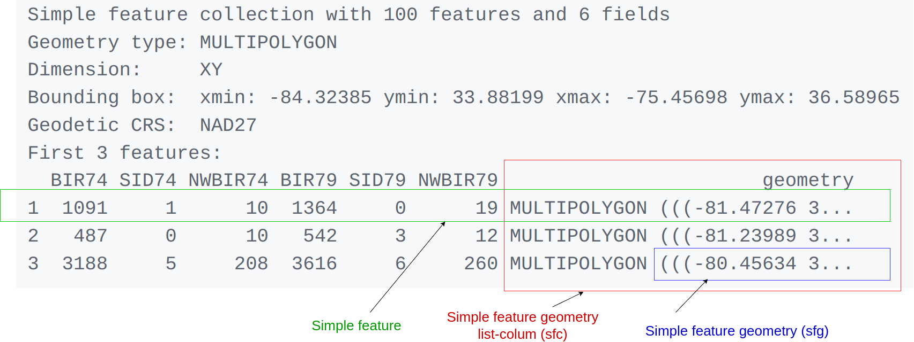

```{r, echo=FALSE, include=FALSE}
knitr::opts_chunk$set(collapse = TRUE)
if (file.exists("nc.shp"))
	file.remove("nc.shp", "nc.dbf", "nc.shx")
```

[Simple features](https://en.wikipedia.org/wiki/Simple_Features) or [_simple feature access_](https://www.ogc.org/publications/standard/sfa/) refers to a formal standard (ISO 19125-1:2004) that describes how objects in the real world can be represented in computers, with emphasis on the _spatial_ geometry of these objects. It also describes how such objects can be stored in and retrieved from databases, and which geometrical operations should be defined for them.

The standard is widely implemented in spatial
databases (such as [PostGIS](https://postgis.net/)), commercial GIS (e.g., [ESRI
ArcGIS](https://www.esri.com/en-us/home)) and forms the vector data basis for
libraries such as [GDAL](https://gdal.org/). A subset of
simple features forms the [GeoJSON](https://geojson.org/) standard.

R has well-supported classes for storing spatial
data ([sp](https://CRAN.R-project.org/package=sp))
and interfacing to the above mentioned environments
([rgdal](https://CRAN.R-project.org/package=rgdal),
[rgeos](https://CRAN.R-project.org/package=rgeos)), but has so far lacked a
complete implementation of simple features, making conversions
at times convoluted, inefficient or incomplete. The package
[sf](https://github.com/r-spatial/sf) tries to fill this gap, and aims
at succeeding [sp](https://CRAN.R-project.org/package=sp) in the
long term.

This vignette:

* explains what is meant by features, and by `simple features`
* shows how they are implemented in R
* provides examples of how you can work with them
* shows how they can be read from and written to external files or resources (I/O)
* discusses how they can be converted to and from `sp` objects
* shows how they can be used for meaningful and applied spatial analysis

# What is a feature?

A `feature` is thought of as a thing, or an object in the real world,
such as a building or a tree. As is the case with objects,
they often consist of other objects. This is the case with features
too: a set of features can form a single feature. A forest stand can
be a feature, a forest can be a feature, a city can be a feature.
A satellite image pixel can be a feature, a complete image can be
a feature too.

Features have a _geometry_ describing _where_ on Earth the
feature is located, and they have attributes, which describe other
properties. The geometry of a tree can be the delineation of
its crown, of its stem, or the point indicating its centre. Other
properties may include its height, color, diameter at breast height
at a particular date, and so on.

The standard says: "_A simple feature is defined by the OpenGIS
Abstract specification to have both spatial and non-spatial
attributes. Spatial attributes are geometry valued, and simple
features are based on 2D geometry with linear interpolation between
vertices._"  We will see soon that the same standard will extend
its coverage beyond 2D and beyond linear interpolation. Here, we
take simple features as the data structures and operations described
in the [standard](https://www.ogc.org/publications/standard/sfa/).

## Dimensions

All geometries are composed of points. Points are coordinates in a
2-, 3- or 4-dimensional space.  All points in a geometry have the
same dimensionality. In addition to X and Y coordinates, there are
two optional additional dimensions:

* a Z coordinate, denoting altitude
* an M coordinate (rarely used), denoting some _measure_ that is associated with the point, rather than with the feature as a whole (in which case it would be a feature attribute); examples could be time of measurement, or measurement error of the coordinates

The four possible cases then are:

1. two-dimensional points refer to x and y, easting and northing, or longitude and latitude, we refer to them as XY
2. three-dimensional points as XYZ
3. three-dimensional points as XYM
4. four-dimensional points as XYZM (the third axis is Z, fourth M)

## Simple feature geometry types

The following seven simple feature types are the most common, and are for instance the only ones used for [GeoJSON](https://www.rfc-editor.org/rfc/rfc7946):

| type | description                                        |
| ---- | -------------------------------------------------- |
| `POINT` | zero-dimensional geometry containing a single point |
| `LINESTRING` | sequence of points connected by straight, non-self intersecting line pieces; one-dimensional geometry |
| `POLYGON` | geometry with a positive area (two-dimensional); sequence of points form a closed, non-self intersecting ring; the first ring denotes the exterior ring, zero or more subsequent rings denote holes in this exterior ring |
| `MULTIPOINT` | set of points; a MULTIPOINT is simple if no two Points in the MULTIPOINT are equal |
| `MULTILINESTRING` | set of linestrings |
| `MULTIPOLYGON` | set of polygons |
| `GEOMETRYCOLLECTION` | set of geometries of any type except GEOMETRYCOLLECTION |

Each of the geometry types can also be a (typed) empty set, containing zero coordinates (for `POINT` the standard is not clear how to represent the empty geometry). Empty geometries can be thought of being the analogue to missing (`NA`) attributes, NULL values or empty lists.

The remaining geometries 10 are rarer, but increasingly find implementations:

| type | description                                        |
| ---- | -------------------------------------------------- |
| `CIRCULARSTRING` | The CIRCULARSTRING is the basic curve type, similar to a LINESTRING in the linear world. A single segment requires three points, the start and end points (first and third) and any other point on the arc. The exception to this is for a closed circle, where the start and end points are the same. In this case the second point MUST be the center of the arc, i.e., the opposite side of the circle. To chain arcs together, the last point of the previous arc becomes the first point of the next arc, just like in LINESTRING. This means that a valid circular string must have an odd number of points greater than 1. |
| `COMPOUNDCURVE` | A compound curve is a single, continuous curve that has both curved (circular) segments and linear segments. That means that in addition to having well-formed components, the end point of every component (except the last) must be coincident with the start point of the following component. |
| `CURVEPOLYGON` | Example compound curve in a curve polygon: CURVEPOLYGON(COMPOUNDCURVE(CIRCULARSTRING(0 0,2 0, 2 1, 2 3, 4 3),(4 3, 4 5, 1 4, 0 0)), CIRCULARSTRING(1.7 1, 1.4 0.4, 1.6 0.4, 1.6 0.5, 1.7 1) ) |
| `MULTICURVE` |  A MultiCurve is a 1-dimensional GeometryCollection whose elements are Curves, it can include linear strings, circular strings or compound strings.  |
| `MULTISURFACE` | A MultiSurface is a 2-dimensional GeometryCollection whose elements are Surfaces, all using coordinates from the same coordinate reference system. |
| `CURVE` | A Curve is a 1-dimensional geometric object usually stored as a sequence of Points, with the subtype of Curve specifying the form of the interpolation between Points |
| `SURFACE` | A Surface is a 2-dimensional geometric object |
| `POLYHEDRALSURFACE` | A PolyhedralSurface is a contiguous collection of polygons, which share common boundary segments  |
| `TIN` | A TIN (triangulated irregular network) is a PolyhedralSurface consisting only of Triangle patches.|
| `TRIANGLE` | A Triangle is a polygon with 3 distinct, non-collinear vertices and no interior boundary |

Note that `CIRCULASTRING`, `COMPOUNDCURVE` and `CURVEPOLYGON` are not described in the SFA standard, but in the [SQL-MM part 3 standard](https://www.iso.org/standard/38651.html). The descriptions above were copied from the [PostGIS manual](http://postgis.net/docs/using_postgis_dbmanagement.html).


## Coordinate reference system

Coordinates can only be placed on the Earth's surface when their coordinate
reference system (CRS) is known; this may be a spheroid CRS such
as [WGS84](https://en.wikipedia.org/wiki/World_Geodetic_System), a
projected, two-dimensional (Cartesian) CRS such as a UTM zone or Web
Mercator, or a CRS in three-dimensions, or including time. Similarly,
M-coordinates need an attribute reference system, e.g. a [measurement
unit](https://CRAN.R-project.org/package=units).

# How simple features in R are organized

Package `sf` represents simple features as native R objects.
Similar to [PostGIS](http://postgis.net/), all functions and methods
in `sf` that operate on spatial data are prefixed by `st_`, which
refers to _spatial type_; this makes them easily findable
by command-line completion.  Simple features are implemented as
R native data, using simple data structures (S3 classes, lists,
matrix, vector).  Typical use involves reading, manipulating and
writing of sets of features, with attributes and geometries.

As attributes are typically stored in `data.frame` objects (or the
very similar `tbl_df`), we will also store feature geometries in
a `data.frame` column. Since geometries are not single-valued,
they are put in a list-column, a list of length equal to the number
of records in the `data.frame`, with each list element holding the simple
feature geometry of that feature.  The three classes used to
represent simple features are:

* `sf`, the table (`data.frame`) with feature attributes and feature geometries, which contains
* `sfc`, the list-column with the geometries for each feature (record), which is composed of
* `sfg`, the feature geometry of an individual simple feature.

We will now discuss each of these three classes.

## sf: objects with simple features

As we usually do not work with geometries of single `simple features`,
but with datasets consisting of sets of features with attributes, the
two are put together in `sf` (simple feature) objects.  The following
command reads the `nc` dataset from a file that is contained in the
`sf` package:

```{r}
library(sf)
nc <- st_read(system.file("shape/nc.shp", package="sf"))
```

(Note that users will not use `system.file()` but give a `filename` directly, and that shapefiles consist of more than one file, all with identical basename, which reside in the same directory.)
The short report printed gives the file name, the driver (ESRI Shapefile), mentions that there are 100 features (records, represented as rows) and 14
fields (attributes, represented as columns). This object is of class

```{r}
class(nc)
```

meaning it extends (and "is" a) `data.frame`, but with a single
list-column with geometries, which is held in the column with name

```{r}
attr(nc, "sf_column")
```

If we print the first three features, we see their attribute values
and an abridged version of the geometry

```{r, echo=TRUE, eval=FALSE}
print(nc[9:15], n = 3)
```
which would give the following output:



In the output we see:

* in green a simple feature: a single record, or `data.frame` row, consisting of attributes and geometry
* in blue a single simple feature geometry (an object of class `sfg`)
* in red a simple feature list-column (an object of class `sfc`, which is a column in the `data.frame`)
* that although geometries are native R objects, they are printed as [well-known text](#wkb)

Methods for `sf` objects are:
```{r}
methods(class = "sf")
```

It is also possible to create `data.frame` objects with geometry list-columns that are not of class `sf`, e.g. by:
```{r}
nc.no_sf <- as.data.frame(nc)
class(nc.no_sf)
```

However, such objects:

* no longer register which column is the geometry list-column
* no longer have a plot method, and
* lack all of the other dedicated methods listed above for class `sf`

## sfc: simple feature geometry list-column

The column in the `sf` data.frame that contains the geometries is a list, of class `sfc`.
We can retrieve the geometry list-column in this case by `nc$geom` or `nc[[15]]`, but the
more general way uses `st_geometry()`:

```{r}
(nc_geom <- st_geometry(nc))
```

Geometries are printed in abbreviated form, but we can
view a complete geometry by selecting it, e.g. the first one by:

```{r}
nc_geom[[1]]
```

The way this is printed is called _well-known text_, and is part of the standards. The word `MULTIPOLYGON` is followed by three parentheses, because it can consist of multiple polygons, in the form of `MULTIPOLYGON(POL1,POL2)`, where `POL1` might consist of an exterior ring and zero or more interior rings, as of `(EXT1,HOLE1,HOLE2)`. Sets of coordinates belonging to a single polygon are held together with parentheses, so we get `((crds_ext)(crds_hole1)(crds_hole2))` where `crds_` is a comma-separated set of coordinates of a ring. This leads to the case above, where `MULTIPOLYGON(((crds_ext)))` refers to the exterior ring (1), without holes (2), of the first polygon (3) - hence three parentheses.

We can see there is a single polygon with no rings:

```{r fig.height=3}
par(mar = c(0,0,1,0))
plot(nc[1], reset = FALSE) # reset = FALSE: we want to add to a plot with a legend
plot(nc[1,1], col = 'grey', add = TRUE)
```

but some of the polygons in this dataset have multiple exterior rings; they can be identified by:
```{r fig.height=3.5}
par(mar = c(0,0,1,0))
(w <- which(sapply(nc_geom, length) > 1))
plot(nc[w,1], col = 2:7)
```

Following the `MULTIPOLYGON` datastructure, in R we have a list of lists of lists of matrices. For instance,
we get the first 3 coordinate pairs of the second exterior ring (first ring is always exterior) for the geometry
of feature 4 by:

```{r}
nc_geom[[4]][[2]][[1]][1:3,]
```

Geometry columns have their own class,

```{r}
class(nc_geom)
```

Methods for geometry list-columns include:
```{r}
methods(class = 'sfc')
```

Coordinate reference systems (`st_crs()` and `st_transform()`) are discussed in the section on [coordinate reference systems](#crs).
`st_as_wkb()` and `st_as_text()` convert geometry list-columns into well-known-binary or well-known-text, explained [below](#wkb).
`st_bbox()` retrieves the coordinate bounding box.

Attributes include:
```{r}
attributes(nc_geom)
```

## Mixed geometry types

The class of `nc_geom` is `c("sfc_MULTIPOLYGON", "sfc")`: `sfc`
is shared with all geometry types, and `sfc_TYPE` with `TYPE`
indicating the type of the particular geometry at hand.

There are two "special" types: `GEOMETRYCOLLECTION`, and `GEOMETRY`.
`GEOMETRYCOLLECTION` indicates that each of the geometries may contain
a mix of geometry types, as in
```{r}
(mix <- st_sfc(st_geometrycollection(list(st_point(1:2))),
    st_geometrycollection(list(st_linestring(matrix(1:4,2))))))
class(mix)
```
Still, the geometries are here of a single type.

The second `GEOMETRY`, indicates that the geometries in the geometry
list-column are of varying type:
```{r}
(mix <- st_sfc(st_point(1:2), st_linestring(matrix(1:4,2))))
class(mix)
```

These two are fundamentally different: `GEOMETRY` is a superclass without instances, `GEOMETRYCOLLECTION` is a geometry instance. `GEOMETRY` list-columns occur when we read in a data source with a mix of geometry types. `GEOMETRYCOLLECTION` *is* a single feature's geometry: the intersection of two feature polygons may consist of points, lines and polygons, see the example [below](#geometrycollection).

## sfg: simple feature geometry

Simple feature geometry (`sfg`) objects carry the geometry for a
single feature, e.g. a point, linestring or polygon.

Simple feature geometries are implemented as R native data, using the following rules

1. a single POINT is a numeric vector
2. a set of points, e.g. in a LINESTRING or ring of a POLYGON is a `matrix`, each row containing a point
3. any other set is a `list`

Creator functions are rarely used in practice, since we typically
bulk read and write spatial data. They are useful for illustration:

```{r}
(x <- st_point(c(1,2)))
str(x)
(x <- st_point(c(1,2,3)))
str(x)
(x <- st_point(c(1,2,3), "XYM"))
str(x)
(x <- st_point(c(1,2,3,4)))
str(x)
st_zm(x, drop = TRUE, what = "ZM")
```
This means that we can represent 2-, 3- or 4-dimensional
coordinates. All geometry objects inherit from `sfg` (simple feature
geometry), but also have a type (e.g. `POINT`), and a dimension
(e.g. `XYM`) class name. A figure illustrates six of the seven most
common types.

With the exception of the `POINT` which has a single point as
geometry, the remaining six common single simple feature geometry
types that correspond to single features (single records, or rows
in a `data.frame`) are created like this

```{r}
p <- rbind(c(3.2,4), c(3,4.6), c(3.8,4.4), c(3.5,3.8), c(3.4,3.6), c(3.9,4.5))
(mp <- st_multipoint(p))
s1 <- rbind(c(0,3),c(0,4),c(1,5),c(2,5))
(ls <- st_linestring(s1))
s2 <- rbind(c(0.2,3), c(0.2,4), c(1,4.8), c(2,4.8))
s3 <- rbind(c(0,4.4), c(0.6,5))
(mls <- st_multilinestring(list(s1,s2,s3)))
p1 <- rbind(c(0,0), c(1,0), c(3,2), c(2,4), c(1,4), c(0,0))
p2 <- rbind(c(1,1), c(1,2), c(2,2), c(1,1))
pol <-st_polygon(list(p1,p2))
p3 <- rbind(c(3,0), c(4,0), c(4,1), c(3,1), c(3,0))
p4 <- rbind(c(3.3,0.3), c(3.8,0.3), c(3.8,0.8), c(3.3,0.8), c(3.3,0.3))[5:1,]
p5 <- rbind(c(3,3), c(4,2), c(4,3), c(3,3))
(mpol <- st_multipolygon(list(list(p1,p2), list(p3,p4), list(p5))))
(gc <- st_geometrycollection(list(mp, mpol, ls)))
```

The objects created are shown here:

```{r, echo=FALSE}
par(mar = c(0.1, 0.1, 1.3, 0.1), mfrow = c(2, 3))
plot(mp, col = 'red')
box()
title("MULTIPOINT")

plot(ls, col = 'red')
box()
title("LINESTRING")

plot(mls, col = 'red')
box()
title("MULTILINESTRING")

plot(pol, border = 'red', col = 'grey', xlim = c(0,4))
box()
title("POLYGON")

plot(mpol, border = 'red', col = 'grey')
box()
title("MULTIPOLYGON")

plot(gc, border = 'grey', col = 'grey')
box()
title("GEOMETRYCOLLECTION")
par(mfrow = c(1, 1))
```

Geometries can also be empty, as in

```{r}
(x <- st_geometrycollection())
length(x)
```

## Well-known text, well-known binary, precision {#wkb}

### WKT and WKB

Well-known text (WKT) and well-known binary (WKB) are two encodings
for simple feature geometries. Well-known text, e.g. seen in
```{r}
x <- st_linestring(matrix(10:1,5))
st_as_text(x)
```
(but without the leading `## [1]` and quotes), is
human-readable. Coordinates are usually floating point numbers,
and moving large amounts of information as text is slow and
imprecise. For that reason, we use well-known binary (WKB) encoding

```{r}
st_as_binary(x)
```

WKT and WKB can both be transformed back into R native objects by

```{r}
st_as_sfc("LINESTRING(10 5, 9 4, 8 3, 7 2, 6 1)")[[1]]
st_as_sfc(structure(list(st_as_binary(x)), class = "WKB"))[[1]]
```

GDAL, GEOS, spatial databases and GIS read and write WKB which
is fast and precise. Conversion between R native objects and WKB
is done by package `sf` in compiled (C++/Rcpp) code, making this a
reusable and fast route for I/O of simple feature geometries in R.

### Precision

One of the attributes of a geometry list-column (`sfc`) is the
`precision`: a double number that, when non-zero, causes some
rounding during conversion to WKB, which might help certain
geometrical operations succeed that would otherwise fail due to
floating point representation. The model is that of GEOS, which
copies from the Java Topology Suite
([JTS](https://locationtech.github.io/jts/)), and works like this:

* if precision is zero (default, unspecified), nothing is modified
* negative values convert to float (4-byte real) precision
* positive values convert to `round(x*precision)/precision`.

For the precision model, see also
[here](https://locationtech.github.io/jts/javadoc/org/locationtech/jts/geom/PrecisionModel.html),
where it is written that: "... to specify 3 decimal places of
precision, use a scale factor of 1000. To specify -3 decimal places
of precision (i.e. rounding to the nearest 1000), use a scale
factor of 0.001." Note that all coordinates, so also `Z` or `M`
values (if present) are affected. Choosing values for `precision`
may require some experimenting.

## Reading and writing

As we've seen above, reading spatial data from an external file can be done by:

```{r}
filename <- system.file("shape/nc.shp", package="sf")
nc <- st_read(filename)
```
we can suppress the output by adding argument `quiet=TRUE` or
by using the otherwise nearly identical but more quiet
```{r}
nc <- read_sf(filename)
```

Writing takes place in the same fashion, using `st_write()`:

```{r}
st_write(nc, "nc.shp")
```

If we repeat this, we get an error message that the file already
exists, and we can overwrite by:

```{r}
st_write(nc, "nc.shp", delete_layer = TRUE)
```

or its quiet alternative that does this by default,

```{r}
write_sf(nc, "nc.shp") # silently overwrites
```

### Driver-specific options

The `dsn` and `layer` arguments to `st_read()` and `st_write()`
denote a data source name and optionally a layer name.  Their exact
interpretation as well as the options they support vary per driver,
the [GDAL driver documentation](https://gdal.org/en/latest/drivers/vector/index.html)
is best consulted for this.  For instance, a PostGIS table in
database `postgis` might be read by:

```{r eval=FALSE}
meuse <- st_read("PG:dbname=postgis", "meuse")
```

where the `PG:` string indicates this concerns the PostGIS driver,
followed by database name, and possibly port and user credentials.
When the `layer` and `driver` arguments are not specified, `st_read()`
tries to guess them from the datasource, or else simply reads the
first layer, giving a warning in case there are more.

`st_read()` typically reads the coordinate reference system as
`proj4string`, but not the EPSG (SRID).  GDAL cannot retrieve SRID
(EPSG code) from `proj4string` strings, and, when needed, it has
to be set by the user. See also the section on [coordinate reference systems](#crs).

`st_drivers()` returns a `data.frame` listing available drivers,
and their metadata: names, whether a driver can write, and whether
it is a raster and/or vector driver. All drivers can read. Reading
of some common data formats is illustrated below:

`st_layers(dsn)` lists the layers present in data source `dsn`,
and gives the number of fields, features and geometry type for each
layer:
```{r eval=FALSE}
st_layers(system.file("osm/overpass.osm", package="sf"))
```
we see that in this case, the number of features is `NA` because
for this xml file the whole file needs to be read, which may be
costly for large files. We can force counting by:
```{r eval=FALSE}
Sys.setenv(OSM_USE_CUSTOM_INDEXING="NO")
st_layers(system.file("osm/overpass.osm", package="sf"), do_count = TRUE)
```

Another example of reading kml and kmz files is:
```{r, eval=FALSE}
# Download .shp data
u_shp <- "http://coagisweb.cabq.gov/datadownload/biketrails.zip"
download.file(u_shp, "biketrails.zip")
unzip("biketrails.zip")
u_kmz <- "http://coagisweb.cabq.gov/datadownload/BikePaths.kmz"
download.file(u_kmz, "BikePaths.kmz")

# Read file formats
biketrails_shp <- st_read("biketrails.shp")
if(Sys.info()[1] == "Linux") # may not work if not Linux
  biketrails_kmz <- st_read("BikePaths.kmz")
u_kml = "http://www.northeastraces.com/oxonraces.com/nearme/safe/6.kml"
download.file(u_kml, "bikeraces.kml")
bikraces <- st_read("bikeraces.kml")
```

### Create, read, update and delete {#crud}

GDAL provides the
[crud](https://en.wikipedia.org/wiki/Create,_read,_update_and_delete)
(create, read, update, delete) functions to persistent storage.
`st_read()` (or `read_sf()`) are used for reading. `st_write()` (or `write_sf()`)
creates, and has the following arguments to control update and delete:

* `update=TRUE` causes an existing data source to be updated, if it
exists; this option is by default `TRUE` for all database drivers,
where the database is updated by adding a table.
* `delete_layer=TRUE` causes `st_write` try to open the data
source and delete the layer; no errors are given if the data source is
not present, or the layer does not exist in the data source.
* `delete_dsn=TRUE` causes `st_write` to delete the data source when
present, before writing the layer in a newly created data source. No
error is given when the data source does not exist. This option
should be handled with care, as it may wipe complete directories
or databases.

### Connection to spatial databases

Read and write functions, `st_read()` and `st_write()`, can handle 
connections to spatial databases to read WKB or WKT directly
without using GDAL.
Although intended to use the DBI interface, current use and testing of these 
functions are limited to PostGIS.

## Coordinate reference systems and transformations {#crs}

Coordinate reference systems (CRS) are like measurement units
for coordinates: they specify which location on Earth a particular
coordinate pair refers to. We saw above that `sfc` objects (geometry
list-columns) have a an attribute of class `crs` that stores the
CRS. This implies that all geometries in a geometry list-column
have the same CRS. It may be `NA` in case the CRS is unknown, or
when we work with local coordinate systems (e.g. inside a building,
a body, or an abstract space); in that case coordinates are assumed
to be Cartesian (in case of 2D: defining positions on in a flat
plane).

A `crs` object contains two character fields: `input` for the
name (if existing) or the user-definition of the CRS, and `wkt`
for the WKT-2 specification; WKT-2 is a standard encoding for
describing CRS that is used throughout the spatial data science
industry.  When defining a CRS, a PROJ string may be used that is
understood by the [PROJ](https://proj4.org/) library. It defines
projection types and (often) defines parameter values for particular
projections, and hence can cover an infinite amount of different
projections. Alternatively, codes like `EPSG:3035` or `OGC:CRS84`
may be used; these are well-known identifiers of CRS defined in
the PROJ database.

Coordinate reference system transformations are carried out using
`st_transform()`, e.g. converting longitudes/latitudes in NAD27 to
web mercator (EPSG:3857) can be done by:

```{r}
nc.web_mercator <- st_transform(nc, "EPSG:3857")
st_geometry(nc.web_mercator)[[4]][[2]][[1]][1:3,]
```

## Conversion, including to and from sp

`sf` objects and objects deriving from `Spatial` (package `sp`) can be coerced both ways:

```{r}
showMethods("coerce", classes = "sf")
methods(st_as_sf)
methods(st_as_sfc)

# anticipate that sp::CRS will expand proj4strings:
p4s <- "+proj=longlat +datum=NAD27 +no_defs +ellps=clrk66 +nadgrids=@conus,@alaska,@ntv2_0.gsb,@ntv1_can.dat"
st_crs(nc) <- p4s

# anticipate geometry column name changes:
names(nc)[15] = "geometry"
attr(nc, "sf_column") = "geometry"
nc.sp <- as(nc, "Spatial")
class(nc.sp)
nc2 <- st_as_sf(nc.sp)
all.equal(nc, nc2)
```

As the `Spatial*` objects only support `MULTILINESTRING` and `MULTIPOLYGON`, `LINESTRING` and `POLYGON` geometries
are automatically coerced into their `MULTI` form. When converting `Spatial*` into `sf`, if all geometries consist of a single
`POLYGON` (possibly with holes), a `POLYGON` and otherwise all geometries are returned as `MULTIPOLYGON`: a
mix of `POLYGON` and `MULTIPOLYGON` (such as common in shapefiles) is not created. Argument `forceMulti=TRUE`
will override this, and create `MULTIPOLYGON`s in all cases. For `LINES` the situation is identical.

## Geometrical operations {#geometrycollection}

The standard for simple feature access defines a number of geometrical operations.

`st_is_valid()` and `st_is_simple()` return a Boolean indicating whether
a geometry is valid or simple.

```{r}
st_is_valid(nc[1:2,])
```

`st_distance()` returns a dense numeric matrix with distances
between geometries. `st_relate()` returns a character matrix with the
[DE9-IM](https://en.wikipedia.org/wiki/DE-9IM#Illustration) values
for each pair of geometries:

```{r}
x = st_transform(nc, 32119)
st_distance(x[c(1,4,22),], x[c(1, 33,55,56),])
st_relate(nc[1:5,], nc[1:4,])
```

`st_intersects()`, `st_disjoint()`, `st_touches()`,
`st_crosses()`, `st_within()`, `st_contains()`, `st_overlaps()`,
`st_equals()`, `st_covers()`, `st_covered_by()`, `st_equals_exact()` and
`st_is_within_distance()` return a sparse matrix (`sgbp` object) with matching (`TRUE`)
indexes, or a full logical matrix:

```{r}
st_intersects(nc[1:5,], nc[1:4,])
st_intersects(nc[1:5,], nc[1:4,], sparse = FALSE)
```

`st_buffer()`, `st_boundary()`, `st_convexhull()`,
`st_union_cascaded`, `st_simplify`, `st_triangulate()`,
`st_polygonize()`, `st_centroid()`, `st_segmentize()`, and `st_union()`
return new geometries, e.g.:

```{r fig.height=3}
sel <- c(1,5,14)
geom = st_geometry(nc.web_mercator[sel,])
buf <- st_buffer(geom, dist = 30000)
plot(buf, border = 'red')
plot(geom, add = TRUE)
plot(st_buffer(geom, -5000), add = TRUE, border = 'blue')
```

`st_intersection()`, `st_union()`, `st_difference()`, and
`st_sym_difference()` return new geometries that are a function of
pairs of geometries:

```{r fig.height=3}
par(mar = rep(0,4))
u <- st_union(nc)
plot(u)
```

The following code shows how computing an intersection between two polygons
may yield a `GEOMETRYCOLLECTION` with a point, line and polygon:

```{r fig.height=3, fig.width=7}
opar <- par(mfrow = c(1, 2))
a <- st_polygon(list(cbind(c(0,0,7.5,7.5,0),c(0,-1,-1,0,0))))
b <- st_polygon(list(cbind(c(0,1,2,3,4,5,6,7,7,0),c(1,0,.5,0,0,0.5,-0.5,-0.5,1,1))))
plot(a, ylim = c(-1,1))
title("intersecting two polygons:")
plot(b, add = TRUE, border = 'red')
(i <- st_intersection(a,b))
plot(a, ylim = c(-1,1))
title("GEOMETRYCOLLECTION")
plot(b, add = TRUE, border = 'red')
plot(i, add = TRUE, col = 'green', lwd = 2)
par(opar)
```

## Non-simple and non-valid geometries

Non-simple geometries are for instance self-intersecting lines (left); non-valid geometries are for instance polygons with slivers (middle) or self-intersections (right).

```{r}
library(sf)
x1 <- st_linestring(cbind(c(0,1,0,1),c(0,1,1,0)))
x2 <- st_polygon(list(cbind(c(0,1,1,1,0,0),c(0,0,1,0.6,1,0))))
x3 <- st_polygon(list(cbind(c(0,1,0,1,0),c(0,1,1,0,0))))
st_is_simple(st_sfc(x1))
st_is_valid(st_sfc(x2,x3))
```

```{r echo=FALSE,fig=TRUE,fig.height=3}
opar <- par(mfrow = c(1,3))
par(mar=c(1,1,4,1))
plot(st_sfc(x1), type = 'b', axes = FALSE, xlab = NULL, ylab = NULL);
title(st_as_text(x1))
plot(st_sfc(st_linestring((cbind(c(0,1,1,1,0,0),c(0,0,1,0.6,1,0))))), type='b', axes = FALSE)
title(st_as_text(x2))
plot(st_sfc(st_linestring(cbind(c(0,1,0,1,0),c(0,1,1,0,0)))), type = 'b', axes=F, xlab=NULL,ylab=NULL)
title(st_as_text(x3))
par(opar)
```

# Units

Where possible geometric operations such as `st_distance()`, `st_length()` and `st_area()` report results with a units attribute appropriate for the CRS:

```{r}
a <- st_area(nc[1,])
attributes(a)
```

The **units** package can be used to convert between units:

```{r}
units::set_units(a, km^2) # result in square kilometers
units::set_units(a, ha) # result in hectares
```

The result can be stripped of their attributes if needs be:

```{r}
as.numeric(a)
```

# How attributes relate to geometries

(This will eventually be the topic of a new vignette; now here to explain the last attribute of `sf` objects)

The standard documents about simple features are very detailed about the geometric aspects of features, but say nearly nothing about attributes, except that their values should be understood in another reference system (their units of measurement, e.g. as implemented in the package [**units**](https://CRAN.R-project.org/package=units)). But there is more to it. For variables like air temperature, interpolation usually makes sense, for others like human body temperature it doesn't. The difference is that air temperature is a field, which continues between sensors, where body temperature is an object property that doesn't extend beyond the body -- in spatial statistics bodies would be called a point pattern, their temperature the point marks. For geometries that have a non-zero size (positive length or area), attribute values may refer to the every sub-geometry (every point), or may summarize the geometry. For example, a state's population density summarizes the whole state, and is not a meaningful estimate of population density for a give point inside the state without the context of the state. On the other hand, land use or geological maps give polygons with constant land use or geology, every point inside the polygon is of that class.
Some properties are spatially [extensive](https://en.wikipedia.org/wiki/Intensive_and_extensive_properties), meaning that attributes would summed up when two geometries are merged: population is an example. Other properties are spatially intensive, and should be averaged, with population density the example.

Simple feature objects of class `sf` have an _agr_ attribute that points to the _attribute-geometry-relationship_, how attributes relate to their geometry. It can be defined at creation time:

```{r}
nc <- st_read(system.file("shape/nc.shp", package="sf"),
    agr = c(AREA = "aggregate", PERIMETER = "aggregate", CNTY_ = "identity",
        CNTY_ID = "identity", NAME = "identity", FIPS = "identity", FIPSNO = "identity",
        CRESS_ID = "identity", BIR74 = "aggregate", SID74 = "aggregate", NWBIR74 = "aggregate",
        BIR79 = "aggregate", SID79 = "aggregate", NWBIR79 = "aggregate"))
st_agr(nc)
data(meuse, package = "sp")
meuse_sf <- st_as_sf(meuse, coords = c("x", "y"), crs = 28992, agr = "constant")
st_agr(meuse_sf)
```

When not specified, this field is filled with `NA` values, but if non-`NA`, it has one
of three possibilities:

| value | meaning                           |
|-------| ----------------------------------|
| constant | a variable that has a constant value at every location over a spatial extent; examples: soil type, climate zone, land use |
| aggregate | values are summary values (aggregates) over the geometry, e.g. population density, dominant land use |
| identity | values identify the geometry: they refer to (the whole of) this and only this geometry |

With this information (still to be done) we can for instance

* either return missing values or generate warnings when a _aggregate_ value at a point location inside a polygon is retrieved, or
* list the implicit assumptions made when retrieving attribute values at points inside a polygon when `relation_to_geometry` is missing.
* decide what to do with attributes when a geometry is split: do nothing in case the attribute is constant, give an error or warning in case it is an aggregate, change the `relation_to_geometry` to _constant_ in case it was _identity_.

Further reading:

1. S. Scheider, B. Gräler, E. Pebesma, C. Stasch, 2016. Modelling spatio-temporal information generation. Int J of Geographic Information Science, 30 (10), 1980-2008. ([open access](https://doi.org/10.1080/13658816.2016.1151520))
2. Stasch, C., S. Scheider, E. Pebesma, W. Kuhn, 2014. Meaningful Spatial Prediction and Aggregation. Environmental Modelling & Software, 51, (149–165, [open access](http://dx.doi.org/10.1016/j.envsoft.2013.09.006)).
